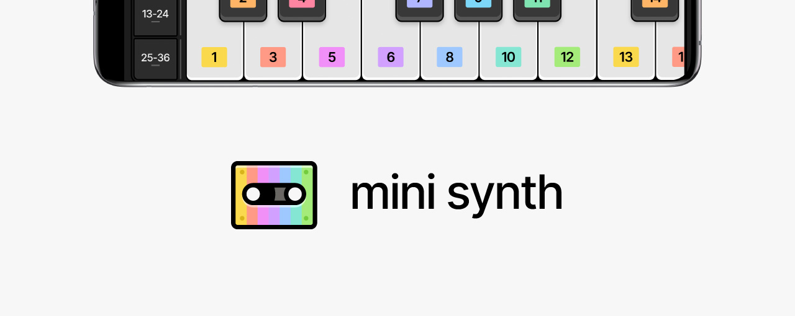
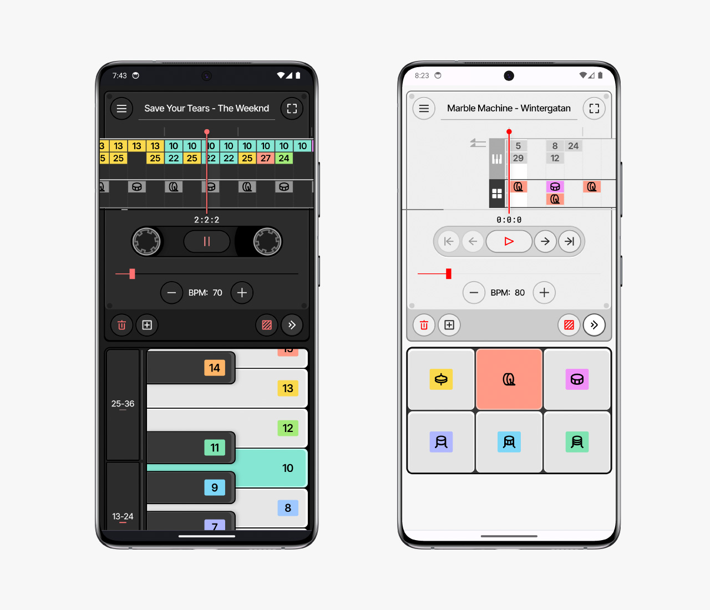

[](https://www.mini-synth.app/)

## What is Mini Synth?

Mini Synth is a simple [Tone.js](https://tonejs.github.io/) synthesizer built with [SvelteKit](https://kit.svelte.dev/). It runs in all major browsers and was designed to provide Ugandan refugees with a tool to create music digitally.

Launch the [production website](https://www.mini-synth.app/) or [learn more about this project in my portfolio](https://www.richardfxr.com/projects/mini-synth).

<br>



## Technical Overview

Mini Synth is built using [SvelteKit](https://kit.svelte.dev/), mostly written in [TypeScript](https://www.typescriptlang.org/), and styled with [Dart Sass](https://sass-lang.com/dart-sass). The production site is deployed using [Vercel](https://vercel.com/). All audio capabilities are built using [Tone.js](https://tonejs.github.io/) and all songs are stored using [IndexedDB](https://developer.mozilla.org/en-US/docs/Web/API/IndexedDB_API/Using_IndexedDB) with [Dexie.js](https://dexie.org/).

## Getting Started

To run the code locally, you must have [Node.js](https://nodejs.org/en) installed. Then, run the following in a terminal in this project's root directory:

```bash
# this will install all dependencies
npm i

# this will start a development server and open the app in a new browser tab
npm run dev -- --open
```

## Commit Messages

[Commit messages](https://github.com/richardfxr/mini-synth/commits/main) are prefixed with the following labels to make them easier to read:

- ♿️A11Y: accessibility
- 🔧CNFG: configuration
- 💄CSS: styling (CSS or SCSS)
- 📐DES: design
- 📝DOC: documentation
- 🐛FIX: bug fix
- 🟠SVLT: Svelte and SvelteKit
- 🚧WIP: work in progress (broken/partial code)
- 🎉RLS: new release

## Architecture

This repository is separated into the [designs](https://github.com/richardfxr/mini-synth/tree/main/designs), [src](https://github.com/richardfxr/mini-synth/tree/main/src), and [static](https://github.com/richardfxr/mini-synth/tree/main/static) directories, along with a few top-level files.

```
designs
├── MiniSynth-GitHub-banner.jpg                GitHub banner image
├── MiniSynth-GitHub-socialPreview.jpg         GitHub social preview image
└── miniSynth-UIconcepts-1.ai                  Illustrator file with all assets

src
├── lib                         libaray of Svelte components
│   ├── SVGs                    all icon SVGs
│   ├── BPMslider.svelte        cassette BPM slider and adjustment buttons (synth)
│   ├── cassetteHeader.svelte   cassette header section (synth)
│   ├── controls.svelte         cassette player controls (synth)
│   ├── envLi.svelte            enviroment list item (info page)
│   ├── footer.svlete           footer (index and info page)
│   ├── helpers.ts              helper functions
│   ├── indexHeader.svelte      header section (index page)
│   ├── keyboard.svelte         piano keyboard for melody input (synth)
│   ├── keyboardControls.svelte three buttons that scroll keyboard (synth)
│   ├── reels.svelte            contrainer for melody and beats tapes (synth)
│   ├── searchBar.svelte        search bar (index page)
│   ├── songLi.svelte           song list item (index page)
│   ├── soundboard.svelte       soundboard for beats input (synth)
│   ├── synth.svelte            main synthesizer (song and demo page)
│   └── tape.svelte             tape (reels)
│
├── routes                      all Svelte file for different pages of the web app
│   ├── demo\[slug]
│   │   └── +page.svelte        dynamic demo page that loads the [slug] demo song
│   │
│   ├── info
│   │   └── +page.svelte        info page
│   │
│   ├── song\[slug]
│   │   └── +page.svelte        dynamic song page that loads the [slug] song
│   │
│   ├── +layout.svelte          layout file (applied to all pages)
│   └── +page.svelte            index page
│
├── storage
│   ├── db.ts                   Dexie database (IndexedDB)
│   └── store.ts                Svelte stores (state management)
│
├── styles                      global styling
│   ├── _colors.scss            sass map with all colors
│   ├── _index.scss             fowards all partial SCSS files in this folder
│   ├── _variables.scss         CSS & SCSS variables
│   ├── global.scss             global styles
│   ├── resets.scss             style resets
│   └── typeface.scss           typeface imports
│
├── app.d.ts                    type definitions
└── app.html                    main HTML

static
├── audio                       audio samples
├── icons                       web manifest icons
├── typefaces                   typeface files
├── app.webmanifest             web manifest
├── *.png                       favicons and icons
└── og-image-1.jpg              Open Graph image
```

